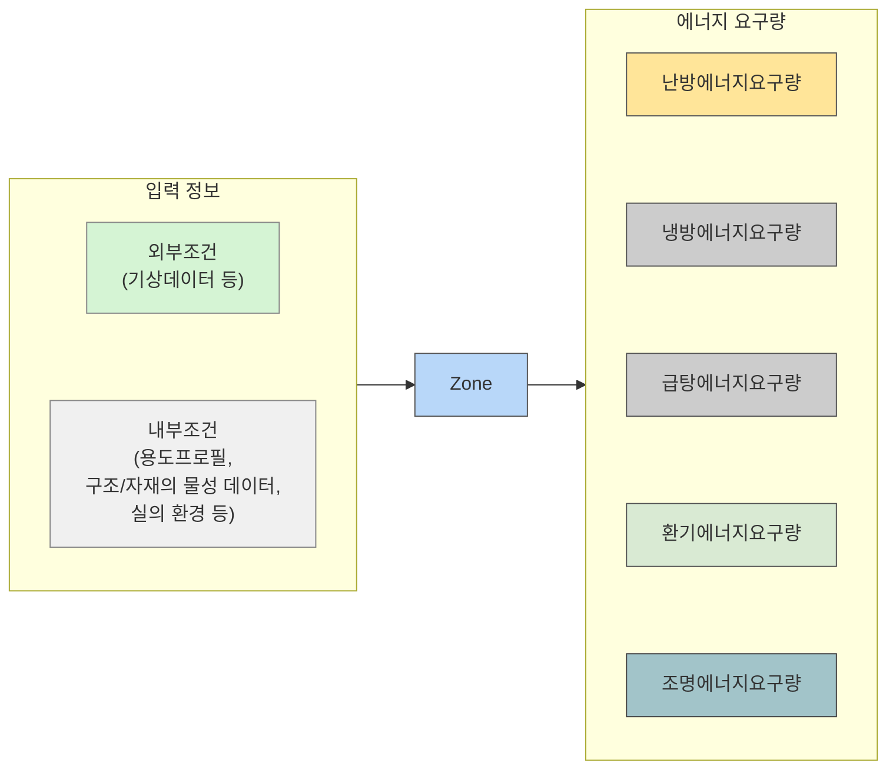

# 프로그램 평가 프로세스

\\( \sum \text{Zone} \\)

```mermaid
flowchart LR
    subgraph Input["입력 정보"]
        A["외부조건\n(기상데이터 등)"] --> B["내부조건\n(용도프로필, \n구조/자재의 물성 데이터,\n실의 환경 등)"]
    end

    Input --> C["Zone"]

    subgraph Output["에너지 요구량"]
        D["난방에너지요구량"] --> E["냉방에너지요구량"] --> F["급탕에너지요구량"] --> G["환기에너지요구량"] --> H["조명에너지요구량"]
    end

    C --> Output


    %% 링크 설정 (숨겨진 HTML 파일 연결)
    click A "weather.html" "_blank"
    click B "hvac.html" "_blank"
    click C "프로그램_평가_프로세스.html" "_blank"
    click D "hvac.html" "_blank"
    click E "/eco2_guide_center/1.%20ECO2%20Logic%20Guide/냉방%20에너지%20분석/냉방_부하_계산.html" "_blank"
    click F "lighting.html" "_blank"
    click G "secondary.html" "_blank"
    click H "primary.html" "_blank"

    %% 스타일 설정
    style A fill:#d5f4d4,stroke:#888,stroke-width:1px
    style B fill:#f0f0f0,stroke:#888,stroke-width:1px
    style C fill:#b8d7f9,stroke:#555,stroke-width:1px
    style D fill:#ffe599,stroke:#555,stroke-width:1px
    style E fill:#ccc,stroke:#555
    style F fill:#ccc,stroke:#555
    style G fill:#d9ead3,stroke:#555
    style H fill:#a2c4c9,stroke:#444

    linkStyle 0 stroke:transparent,stroke-width:0.1px
    linkStyle 1 stroke:#333,stroke-width:1px
    linkStyle 2 stroke:transparent,stroke-width:0.1px
    linkStyle 3 stroke:transparent,stroke-width:0.1px
    linkStyle 4 stroke:transparent,stroke-width:0.1px
    linkStyle 5 stroke:transparent,stroke-width:0.1px
    linkStyle 6 stroke:#333,stroke-width:1px
```