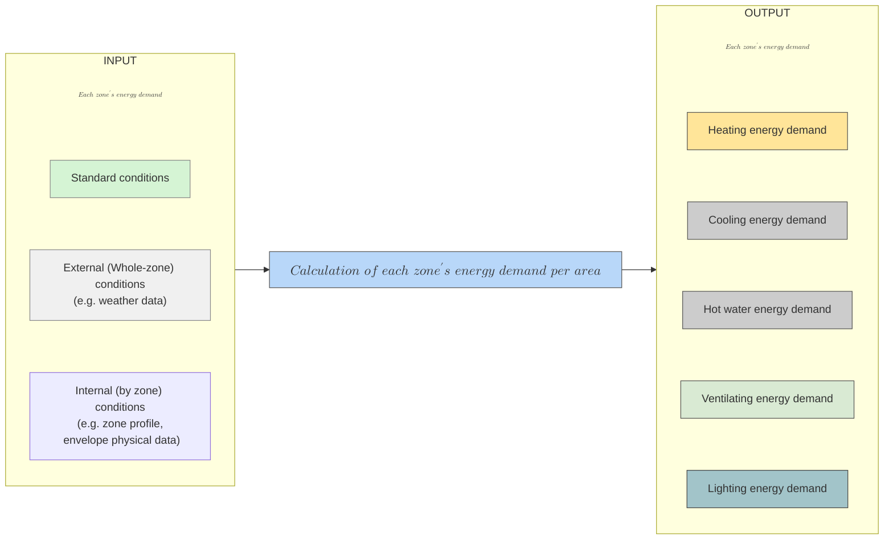

# 프로그램 평가 프로세스

\( A\ building's\ energy\ demand\ per\ area\ =\ \sum_{}^{} (Each\ zones'\ energy\ demand\ per\ area) \) 

```mermaid
flowchart LR
    subgraph Input["INPUT"]
        NoteA["<div>$$Each\ zone's\ energy\ demand$$</div>"] --- A["Standard conditions"] 
        A --- B["External (Whole-zone) conditions\n(e.g. weather data)"] --- I["Internal (by zone) conditions\n(e.g. zone profile,\n envelope physical data)"]
    end

    Input --> C["<div>$$Calculation\ of\ each\ zone's\ energy\ demand\ per\ area$$</div>"]

    subgraph Output["OUTPUT"]
        direction TB
        NoteB["<div>$$Each\ zone's\ energy\ demand$$</div>"] --- D["Heating energy demand"]
        D --- E["Cooling energy demand"]
        E --- F["Hot water energy demand"]
        F --- G["Ventilating energy demand"]
        G --- H["Lighting energy demand"]
    end

    C --> Output

    %% 링크 설정
    click A "/eco2_guide_center_yealone/1.%20ECO2%20Logic%20Guide/Standard_conditions.html" "_blank"
    click B "/eco2_guide_center_yealone/1.%20ECO2%20Logic%20Guide/External_conditions.html" "_blank"
    click C "프로그램_평가_프로세스.html" "_blank"
    click D "hvac.html" "_blank"
    click E "/eco2_guide_center_yealone/1.%20ECO2%20Logic%20Guide/냉방%20에너지%20분석/Cooling_energy_demand.html" "_blank"
    click F "/eco2_guide_center_yealone/1.%20ECO2%20Logic%20Guide/냉방%20에너지%20분석/Simple_Method.html" "_blank"
    click G "secondary.html" "_blank"
    click H "primary.html" "_blank"
    click I "/eco2_guide_center_yealone/1.%20ECO2%20Logic%20Guide/Internal_conditions.html" "_blank"

    %% 스타일 설정
    style A fill:#d5f4d4,stroke:#888,stroke-width:1px
    style B fill:#f0f0f0,stroke:#888,stroke-width:1px
    style C fill:#b8d7f9,stroke:#555,stroke-width:1px
    style D fill:#ffe599,stroke:#555,stroke-width:1px
    style E fill:#ccc,stroke:#555
    style F fill:#ccc,stroke:#555
    style G fill:#d9ead3,stroke:#555
    style H fill:#a2c4c9,stroke:#444

    %% 핵심: Note 노드 스타일을 Mermaid 방식으로 지정
    style NoteA fill:transparent,stroke:transparent,stroke-width:0px,color:#444,font-size:8px,font-style:italic
    style NoteB fill:transparent,stroke:transparent,stroke-width:0px,color:#444,font-size:8px,font-style:italic

    %% 링크선 스타일
    linkStyle 0 stroke:transparent,stroke-width:0.1px
    linkStyle 1 stroke:transparent,stroke-width:0.1px
    linkStyle 2 stroke:transparent,stroke-width:0.1px
    linkStyle 3 stroke:#333,stroke-width:1px
    linkStyle 4 stroke:transparent,stroke-width:0.1px
    linkStyle 5 stroke:transparent,stroke-width:0.1px
    linkStyle 6 stroke:transparent,stroke-width:0.1px
    linkStyle 7 stroke:transparent,stroke-width:0.1px 
    linkStyle 8 stroke:transparent,stroke-width:0.1px 
    linkStyle 9 stroke:#333,stroke-width:1px
```