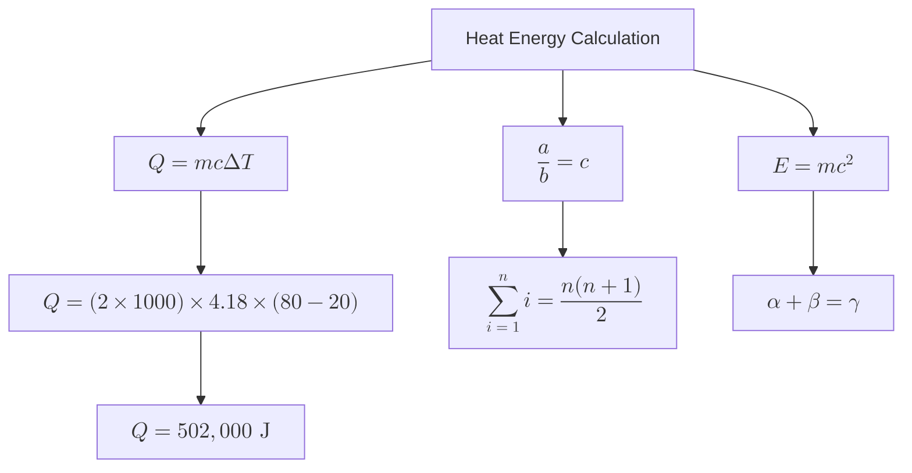

# Equation Diagram 
## 🔹 (Temporarily) Cooling Energy Demand Only
---

```mermaid
graph TD
    A["Heat Energy Calculation"] --> B["<div>$$Q = mc\Delta T$$</div>"]
    B --> C["<div>$$Q = (2 \times 1000) \times 4.18 \times (80 - 20)$$</div>"]
    C --> D["<div>$$Q = 502,000 \text{ J}$$</div>"]

    A --> E["<div>$$\frac{a}{b} = c$$</div>"]
    E --> F["<div>$$\sum_{i=1}^{n} i = \frac{n(n+1)}{2}$$</div>"]

    A --> G["<div>$$E = mc^2$$</div>"]
    G --> H["<div>$$\alpha + \beta = \gamma$$</div>"]
```
