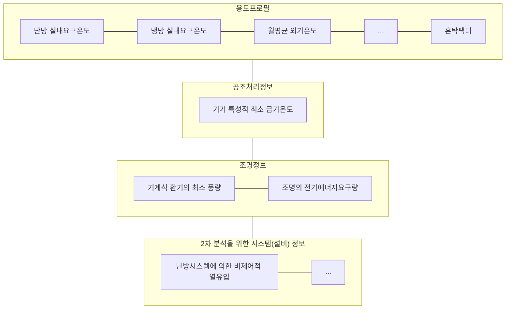
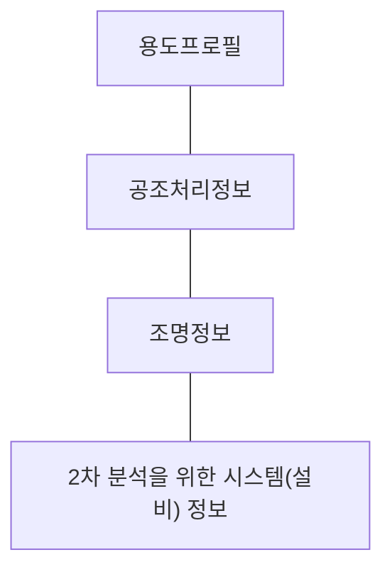

```mermaid
flowchart TD
    subgraph UsageProfile[용도프로필]
        A[난방 실내요구온도] --- B[냉방 실내요구온도] --- C[월평균 외기온도] --- D["..."] --- E[혼탁팩터]
    end

    subgraph VentilatingProcessingInfo[공조처리정보]
        F[기기 특성적 최소 급기온도] 
        end

    subgraph LightingInfo[조명정보]
        G[기계식 환기의 최소 풍량] --- H[조명의 전기에너지요구량]
    end

    subgraph SecondaryAnalysis["2차 분석을 위한 시스템(설비) 정보"]
        I[난방시스템에 의한 비제어적 열유입] --- J["..."]
    end

    UsageProfile --- VentilatingProcessingInfo --- LightingInfo --- SecondaryAnalysis
```

```mermaid
flowchart TD
    A[용도프로필]---B[공조처리정보]---C[조명정보]---D["2차 분석을 위한 시스템(설비) 정보"]
```
