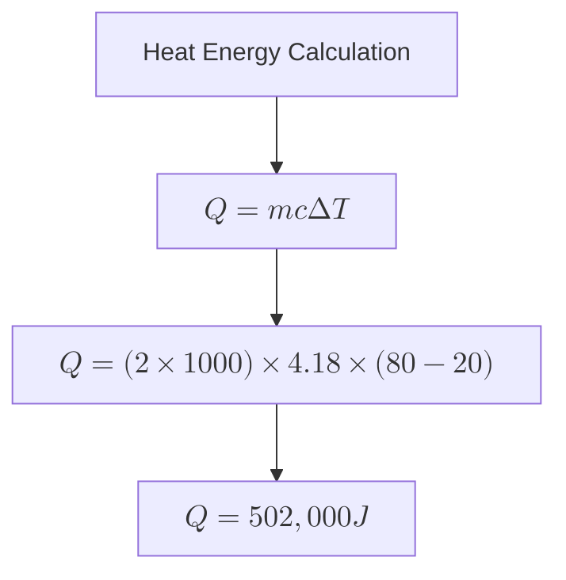
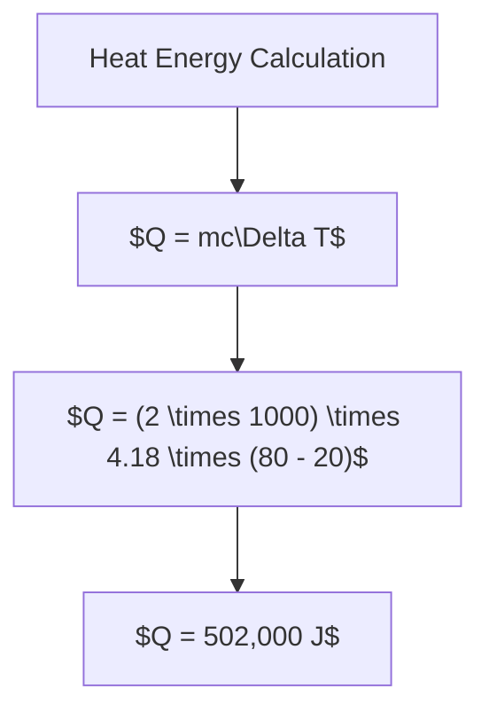
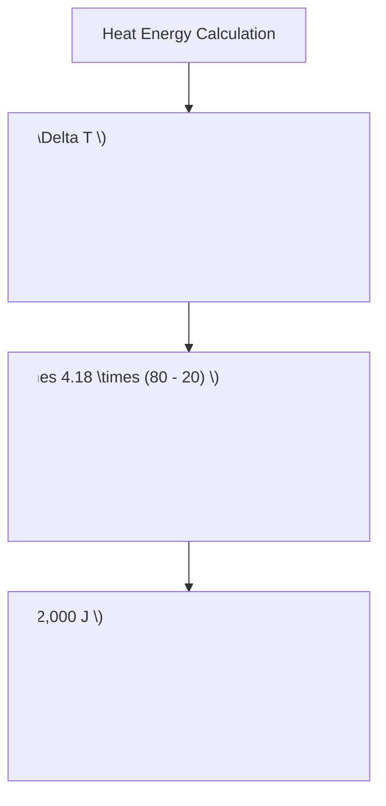
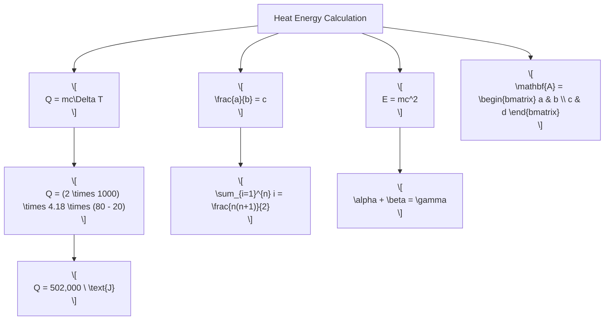

# Simple Method 

## 🔹 Introduction
냉방 부하 계산은 건물의 열 부하를 평가하고 냉방 시스템의 성능을 최적화하는 과정입니다.  
이를 통해 적정 용량을 설정하고 에너지 효율을 높일 수 있습니다.

냉방 부하 계산에는 다양한 접근 방식이 있으며, ECO2에서는 간단하면서도 직관적인 Simple Method를 활용합니다.  

---

  { loading=lazy width=600 }  
  **Figure 1. Energy Flow Diagram**

## 🔹 Key Formula
The core equation for heat energy calculation is:

$$
Q = mc\Delta T
$$

Where:  
- **Q** = Heat energy (Joules)  
- **m** = Mass (kg)  
- **c** = Specific heat capacity (J/kg·K)  
- **ΔT** = Temperature change (K)

---

## 🔹 Example Calculation
Let's calculate the energy required to heat 2 kg of water from 20°C to 80°C. Assuming water's specific heat capacity is \( 4.18 \ \mathrm{J/g \cdot K} \)..

$$
Q = (2 \times 1000) \times 4.18 \times (80 - 20) = 502,000 \ \text{J}
$$

---

## 🔹 Mindmap Overview

``` mermaid
graph TD
    A[Start] --> B{Who's Awesome?}
    B -->|전성희님| C[전성희님은 최고입니다]
    C --> D[택시 후원 감사합니다]
    B -->|You| E[You're Awesome Too!]

```

## 🔹 Example Calculation (with MathJax)

``` mermaid
graph TD
    A[Heat Energy Calculation] --> B["Q = m × c × ΔT"]
    B --> C["Q = (2 × 1000) × 4.18 × (80 - 20)"]
    C --> D["Q = 502,000 J"]
```

``` mermaid
graph TD
    A[Start] --> B{Is it working?}
    B -->|Yes| C["Q = m × c × ΔT"]
    B -->|No| D["Try Again"]
```

```mermaid
graph TD
    A["Heat Energy Calculation"] --> B["Q = m &times; c &times; ΔT"]
    B --> C["Q = (2 × 1000) × 4.18 × (80 - 20)"]
    C --> D["Q = 502,000 J"]
```

