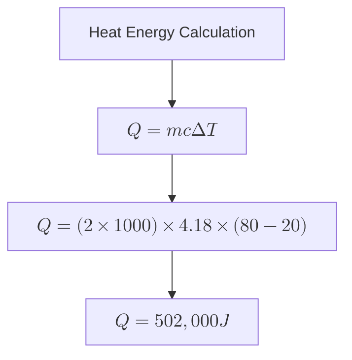
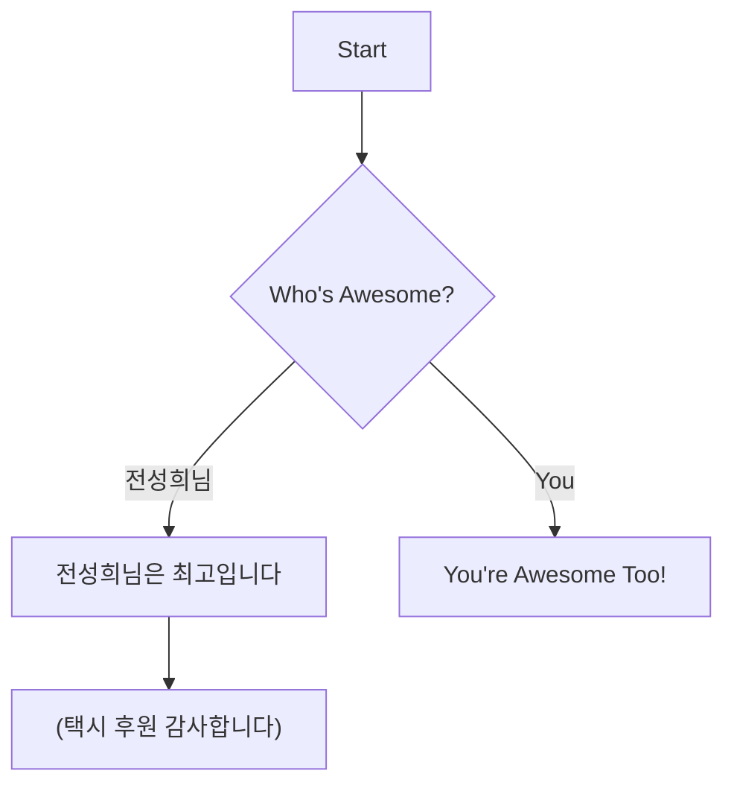
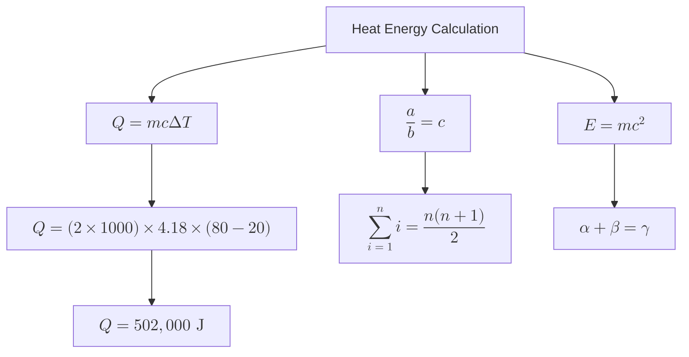

# Simple Method 

## 🔹 Introduction
냉방 부하 계산은 건물의 열 부하를 평가하고 냉방 시스템의 성능을 최적화하는 과정입니다.  
이를 통해 적정 용량을 설정하고 에너지 효율을 높일 수 있습니다.

냉방 부하 계산에는 다양한 접근 방식이 있으며, ECO2에서는 간단하면서도 직관적인 Simple Method를 활용합니다.  

---

  
  
<strong>Figure 1. Energy Flow Diagram</strong>

<!--만일 센터 정렬 안하려면 다음과 같이 간단히 표현 가능

**Figure 1. Energy Flow Diagram** -->

## 🔹 Key Formula
The core equation for heat energy calculation is:

$$
Q = mc\Delta T
$$

Where:  
- **Q** = Heat energy (Joules)  
- **m** = Mass (kg)  
- **c** = Specific heat capacity (J/kg·K)  
- **ΔT** = Temperature change (K)

---

## 🔹 Example Calculation
Let's calculate the energy required to heat 2 kg of water from 20°C to 80°C. Assuming water's specific heat capacity is \( 4.18 \ \mathrm{J/g \cdot K} \)..

$$
Q = (2 \times 1000) \times 4.18 \times (80 - 20) = 502,000 \ \text{J}
$$

---

## 🔹 Mindmap Overview

왜 안될꼬...?