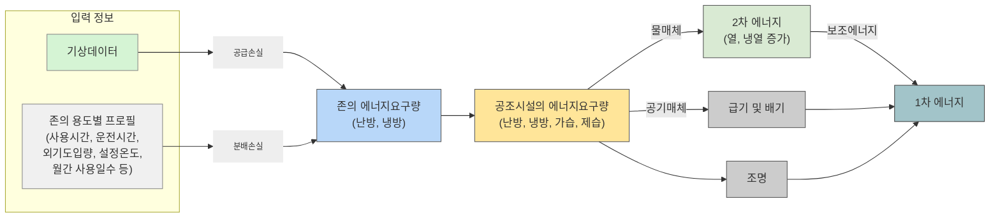

# 프로그램 평가 프로세스

```mermaid 
flowchart LR
    subgraph Input["입력 정보"]
        A["기상데이터"]
        B["존의 용도별 프로필\n(사용시간, 운전시간,\n외기도입량, 설정온도,\n월간 사용일수 등)"]
    end

    A --> SupplyLoss["공급손실"] --> C["존의 에너지요구량\n(난방, 냉방)"]
    B --> DistributionLoss["분배손실"] --> C

    C --> D1["공조시설의 에너지요구량\n(난방, 냉방, 가습, 제습)"]

    D1 -->|공기매체| E1["급기 및 배기"]
    D1 --> F1["조명"]

    D1 -->|물매체| G1["2차 에너지\n(열, 냉열 증가)"]
    G1 -->|보조에너지| H1["1차 에너지"]
    E1 --> H1
    F1 --> H1

    %% 링크 설정
    click A "weather.html" "_blank"
    click B "resources/profile.html" "_blank"
    click SupplyLoss "supply_loss.html" "_blank"
    click DistributionLoss "resources/distribution_loss.html" "_blank"
    click C "resources/energy.html" "_blank"
    click D1 "hvac.html" "_blank"
    click E1 "resources/air.html" "_blank"
    click F1 "resources/lighting.html" "_blank"
    click G1 "resources/secondary.html" "_blank"
    click H1 "resources/primary.html" "_blank"

    %% 스타일 설정
    style A fill:#d5f4d4,stroke:#888,stroke-width:1px
    style B fill:#f0f0f0,stroke:#888,stroke-width:1px
    style SupplyLoss fill:#eeeeee,stroke:none,font-size:12px
    style DistributionLoss fill:#eeeeee,stroke:none,font-size:12px
    style C fill:#b8d7f9,stroke:#555,stroke-width:1px
    style D1 fill:#ffe599,stroke:#555,stroke-width:1px
    style E1 fill:#ccc,stroke:#555
    style F1 fill:#ccc,stroke:#555
    style G1 fill:#d9ead3,stroke:#555
    style H1 fill:#a2c4c9,stroke:#444

    linkStyle default stroke:#333,stroke-width:1px

```