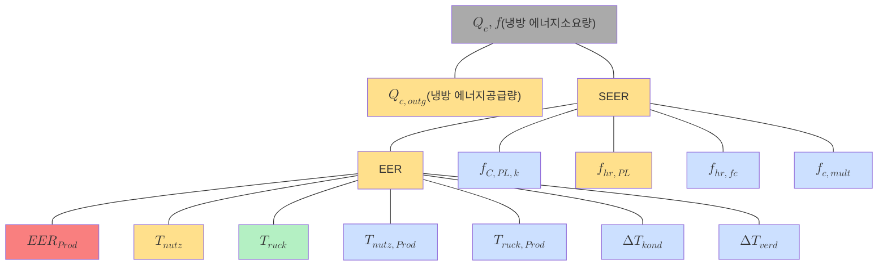

# Cooling Equipment (냉방기기)

## 🔹 Introduction
건축물 내 냉방 열원을 생성하는 장비의 정보를 입력하기 위한 항목들로 구성되며, 냉동기 방식, 냉동기용량, 정격냉열성능지수, 신·재생설비와 열병합발전시스템의 연결여부 등이 입력됩니다. 

## 주요 입력 항목

| 항목 | 설명 |
|------|------|
| 냉동기 방식 | 압축식 / 흡수식 / 항온항습기 / 축열시스템 등 |
| 냉동기 용량 | kW 단위로 입력, 동일 방식은 합산 입력 |
| 정격 COP | 정격 냉열 성능지수 (Cooling Performance Index) |
| 신재생/열병합 연결 여부 | 지열, 태양열, 지역난방, CHP 등 |
| 냉각방식 | 수냉식, 공랭식, 증발식, 기계통풍식 등 |
| 항온항습기 | 실별 냉방, 전산실 여부, 냉수식/공조기형 구분 |

---

## 냉동기 종류

### 1. 압축식 냉동기
- **방식**: 터보 / 스크류 / 스크롤 / 왕복동
- **냉각방식**: 수냉식 / 공랭식
- **실내·실외기 구성**: 일체형 / 분리형 / 멀티형
- 동일 방식의 냉동기가 하나의 배관망으로 연결되어 있으면 **용량을 합산하여 입력**합니다.
- **COP는 가중평균값**으로 입력되며, 시험성적서 제출 시 수동값 인정 가능

### 2. 흡수식 냉동기
- **직화식**: COP = 냉방출력 ÷ (연료소비량 × 고위발열량)
- **지역난방 이용형**: COP = (냉수유량 × 온도차) ÷ (중온수유량 × 온도차)

## 재냉각기 (냉각탑)
- **유형**: 증발식 / 건식 / 자연통풍 / 기계통풍
- **보조방음장치**가 장비일람표에 명기된 경우만 인정됨

## 항온항습기 (Precision Air Conditioning Unit)
- **냉방능력 / 소비전력** 기반으로 COP 계산
- 수냉식: 보통 단독 열원 판단 불가 → 전산실로 프로필 설정 시 인정 가능
- 냉수식: 중앙 냉동기에서 공급되며 별도 열원 생성 없음
- 공조기형: 중앙열원 or 직팽식 공조기 사용 여부 입력

## 축열식 시스템
- **빙축열 / 수축열 시스템**
- 주간 or 야간 기준 용량, 소비전력으로 COP 계산
- 순환펌프 구성 포함

---

## 프로그램 입력값 예시

냉방기기 입력 시 다음과 같은 항목을 입력해야 합니다.

| 항목 | 설명 | 예시 값 |
|------|------|---------|
| 냉방방식 | EHP, GHP, 터보 등 선택 | EHP |
| 계약용량 | 장비 정격 출력 | 12kW |
| 정격 냉방효율 (EER) | 장비 일람표 기준 | 2.9 |
| 부분부하효율 (SEER) | 계절평균효율 | 2.9 |
| 제어방식 | 인버터, 정속형 등 | 인버터 |

## 냉각 시스템 에너지 소요량 산정 예시 다이어그램

