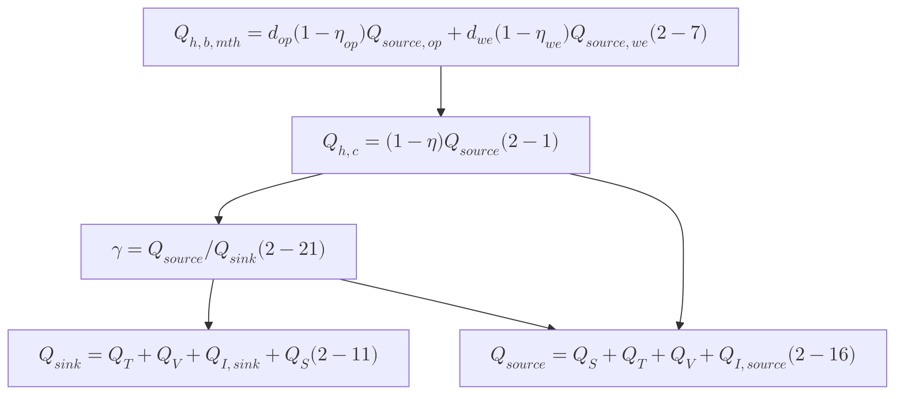
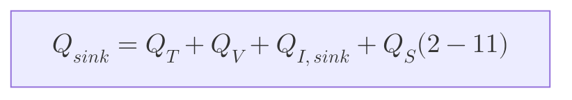

# Equation Diagram 
## 🔹 Cooling Energy Demand
---

```mermaid
flowchart TD
    A["<div>$$Q_{h,b,mth} = d_{op}(1 - η_{op})Q_{source,op} + d_{we}(1 - η_{we})Q_{source,we}  (2-7)$$</div>"]
    B["<div>$$Q_{h,c} = (1 - η)Q_{source}  (2-1)$$</div>"]
    C["<div>$$γ = Q_{source} / Q_{sink}  (2-21)$$</div>"]
    D["<div>$$Q_{sink} = Q_T + Q_V + Q_{I,sink} + Q_S  (2-11)$$</div>"]
    E["<div>$$Q_{source} = Q_S + Q_T + Q_V + Q_{I,source}  (2-16)$$</div>"]

    A --> B
    B --> C
    B --> E
    C --> D
    C --> E

    click A "Internal_conditions.html" "_blank"
    click B "External_conditions.html" "_blank"
    click C "Standard_conditions.html" "_blank"
    click D "heat_gain.html" "_blank"
    click E "Standard_conditions.html" "_blank"
```

---

```mermaid
flowchart TD
    A["$$Q_{sink} = Q_T + Q_V + Q_{I,sink} + Q_S  (2-11)$$"]

    click A "equation_page_list.html?eq=2-11-11" "_self"
```